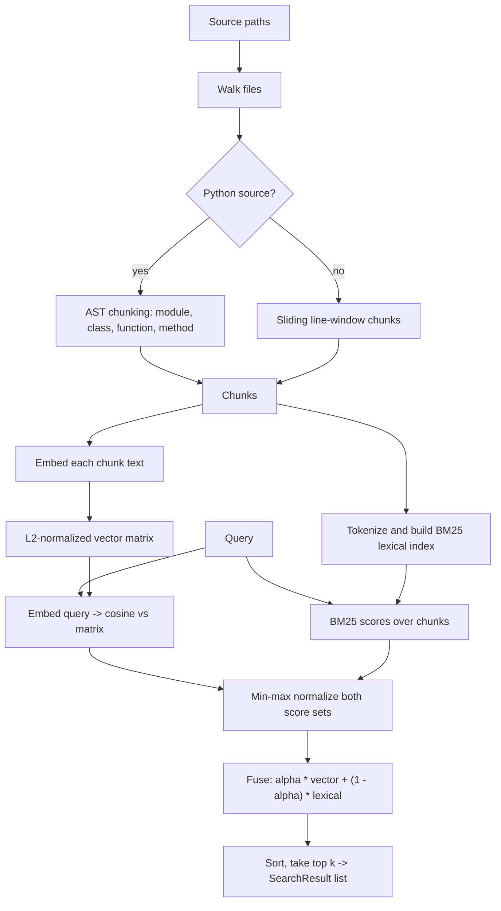

# hybrid-code-search

Search a codebase by meaning and by name. The engine splits source into AST-aware
chunks (functions, classes, methods, and line windows for everything else), embeds
each chunk into a dense vector, and ranks results by fusing dense cosine similarity
with a BM25 lexical score. Identifier matches and paraphrased-intent matches both
contribute to the final ranking.

The default embedder is a deterministic feature-hashing embedder. It requires no
model download and no network, so indexing and search run offline out of the box. A
sentence-transformers backend is available as an optional extra when you want learned
semantic vectors.

## Why hybrid

Pure dense embeddings miss exact identifier and API-name matches that matter in code.
Pure lexical search misses queries phrased differently from the source. Fusing the two
covers both cases. The balance between them is a single parameter, `alpha`.

## Install

    pip install -e ".[dev]"

The optional learned-embedding backend:

    pip install -e ".[transformers]"

Requires Python 3.11 or newer.

## Quickstart (library)

`build_index` chunks one or more paths and returns a queryable `CodeIndex`. With no
embedder argument it resolves one from the environment (default: the hashing embedder).

    from hybrid_code_search import build_index

    index = build_index(["src/"])
    results = index.search("parse json config", k=5, alpha=0.5)

    for r in results:
        c = r.chunk
        print(f"{c.path}:{c.start_line}-{c.end_line} {c.symbol or c.kind} {r.score:.4f}")

Each `SearchResult` carries the matched `Chunk`, the fused `score` (in `[0, 1]`), the
raw `vector_score` (cosine similarity in `[-1, 1]`), and the min-max normalized
`lexical_score` (in `[0, 1]`).

To build an index directly from `Chunk` objects, or with an explicit embedder:

    from hybrid_code_search import CodeIndex, HashingEmbedder, chunk_paths

    chunks = chunk_paths(["src/"])
    index = CodeIndex.build(chunks, HashingEmbedder(dim=256))
    results = index.search("retry with backoff", k=10, alpha=0.7)

`CodeIndex.build(chunks, embedder=None)` falls back to a default `HashingEmbedder` when
no embedder is passed. `CodeIndex.search(query, k=10, alpha=0.5)` returns an empty list
for an empty index or a blank query. `k` is clamped to the number of chunks.

The index exposes `.chunks`, `.matrix`, `.vectors`, `.embedder`, `.embedder_name`,
`.dim`, and `len(index)`.

### Persistence

The store module serializes an index to JSON, including the stored vectors, so loading
never re-embeds:

    from hybrid_code_search import save_index, load_index

    save_index(index, "code.index.json")
    index = load_index("code.index.json")

## How it works



1. **Chunk.** Files are walked, skipping dot-directories and a fixed set of build
   directories (`node_modules`, `.git`, `.venv`, `dist`, `build`, `__pycache__`),
   binary files (those containing a NUL byte in the first 8 KiB), and files larger
   than `max_file_bytes` (default 1,000,000). Python files are parsed with the
   standard-library `ast` module and split into module, class, function, and method
   chunks; on a `SyntaxError` they fall back to line windows. All other files are split
   into overlapping 40-line windows with 10 lines of overlap (kind `block`). Language is
   inferred from the file extension.

2. **Embed.** Each chunk's text is mapped to a fixed-dimension, L2-normalized vector by
   the configured embedder. The default `HashingEmbedder` hashes tokens into buckets
   with a signed count using blake2b (stable across processes, unlike the builtin
   `hash()`).

3. **Index.** Vectors are stacked into a float32 matrix with each row re-normalized. In
   parallel, chunk text is tokenized and a `LexicalIndex` precomputes BM25 document
   frequencies, term frequencies, lengths, and IDF.

4. **Rank.** At query time the query vector's cosine similarity against every row gives
   the vector scores; BM25 gives the lexical scores. Both sets are min-max normalized to
   `[0, 1]` and combined as `alpha * vector + (1 - alpha) * lexical`. Results are sorted
   by the fused score (ties broken by chunk id) and the top `k` are returned.

Tokenization splits on non-alphanumeric characters and further decomposes camelCase,
snake_case, and letter/digit boundaries, lowercasing each token. Single-character
tokens are dropped unless purely numeric. BM25 uses `k1 = 1.5`, `b = 0.75`.

## Repository map

```text
.
|-- src/hybrid_code_search/
|   |-- chunker.py        # File walk, Python AST chunks, line windows
|   |-- embedder.py       # Hashing embedder, optional sentence-transformers
|   |-- tokenize.py       # Code-aware tokenizer
|   |-- ranking.py        # BM25 lexical index and score fusion
|   |-- index.py          # CodeIndex build and search
|   |-- store.py          # JSON save and load
|   |-- cli.py            # scs command
|   `-- service.py        # FastAPI app
|-- tests/                # pytest suite
|-- docs/                 # Architecture notes and diagram sources
|-- vault/                # Design notes (chunking, ranking, glossary)
|-- .github/              # CI configuration
|-- pyproject.toml        # Package metadata, extras, tool config
`-- CONTRIBUTING.md
```

The README diagram source is in [docs/architecture.mmd](docs/architecture.mmd). A detailed
version is in [docs/diagrams/pipeline.mmd](docs/diagrams/pipeline.mmd), with notes in
[docs/architecture.md](docs/architecture.md).

## CLI

The package installs a `scs` command (two subcommands).

Build a persisted index from a source tree:

    scs index src/ --out code.index.json --embedder hashing

Search a persisted index:

    scs search "open a file safely" --index-path code.index.json --k 10 --alpha 0.5

`scs index` takes the source tree as a positional argument; defaults: `--out
code.index.json`, `--embedder hashing`. `scs search` takes the query as a positional
argument; defaults: `--index-path code.index.json`, `--k 10`, `--alpha 0.5`. Search
prints one line per result (`path:start-end symbol score`) followed by an indented,
whitespace-collapsed snippet capped at 120 characters. If the index file is missing or
unreadable, `scs search` prints an error and exits with status 1.

## HTTP API

The service is a FastAPI app created by `create_app`. It holds a single in-memory index
on application state; `POST /index` rebuilds it. `create_app(index=None)` optionally
accepts a pre-built index; otherwise it starts with an empty one.

    import uvicorn
    from hybrid_code_search.service import create_app

    uvicorn.run(create_app(), host="127.0.0.1", port=8000)

### `POST /index`

Rebuilds the index from disk. Provide either `paths` (a list) or `root` (a single
directory); one is required, or the call returns 400.

    {"root": "src/"}
    {"paths": ["src/", "lib/"]}

Response:

    {"chunks": 128}

### `POST /search`

    {"query": "decode base64", "k": 10, "alpha": 0.5}

`k` is constrained to `[1, 1000]`, `alpha` to `[0.0, 1.0]`. An empty query or one over
2000 characters returns 400. Response is a list of search results:

    [
      {
        "chunk": {
          "id": "…", "path": "src/x.py", "language": "python",
          "kind": "function", "symbol": "decode", "start_line": 10,
          "end_line": 24, "text": "…"
        },
        "score": 0.81, "vector_score": 0.42, "lexical_score": 1.0
      }
    ]

### `GET /health`

    {"status": "ok", "version": "0.1.0", "chunks": 128}

## Configuration

**Embedder.** Selected via constructor argument, the `--embedder` CLI flag, or the
`resolve_embedder` helper, which reads environment variables when no argument is given:

- `SCS_EMBEDDER`: `hashing` (default) or `sentence-transformers`.
- `SCS_MODEL`: model name, required when `SCS_EMBEDDER=sentence-transformers`.

The `sentence-transformers` backend requires the `transformers` extra; constructing it
without the dependency installed raises a clear `ImportError`. Selecting it without a
model name raises `ValueError`.

**alpha.** The fusion weight in `[0, 1]`. `alpha = 1.0` is pure vector similarity,
`alpha = 0.0` is pure BM25, `alpha = 0.5` (default) weights them equally. Raise it for
conceptual queries, lower it for exact-identifier queries.

**k.** Maximum number of results to return. The library clamps it to the number of
chunks; the HTTP API constrains it to `[1, 1000]`.

**Chunking.** `chunk_paths(paths, max_file_bytes=1_000_000)` controls the maximum file
size to consider. Skip directories and window size (40 lines, 10-line overlap) are
fixed constants in `chunker.py`.

## Limitations

- AST-aware chunking is implemented for Python only. Every other language is split into
  fixed line windows, which can cut across symbol boundaries. The extension-to-language
  map only labels chunks; it does not change how non-Python files are chunked.
- The default `HashingEmbedder` is not a trained model. It captures token overlap, not
  learned semantics; "vector similarity" with it is closer to a hashed bag-of-tokens
  measure than to meaning. For genuine semantic retrieval, use the
  `sentence-transformers` backend.
- The index is entirely in memory. There is no approximate nearest-neighbor structure:
  search is a dense matrix-vector product over all chunks, which is linear in corpus
  size. This is fine for a single repository and will not scale to very large corpora.
- The index is static once built. There is no incremental update or file-watching;
  changing source requires rebuilding (`build_index` / `scs index` / `POST /index`).
- The HTTP service keeps one index in process memory with no authentication, no
  persistence across restarts, and no concurrency control beyond replacing the index
  reference on re-index.
- Persisted indexes store raw vectors as JSON. The format is inspectable but not
  compact, and is versioned (`version: 1`); loading a different version raises.
- Files are decoded as UTF-8 with replacement; unreadable files are silently skipped
  and contribute no chunks.

## Development

    ruff check .
    ruff format --check .
    mypy src
    pytest --cov=hybrid_code_search

## License

MIT
