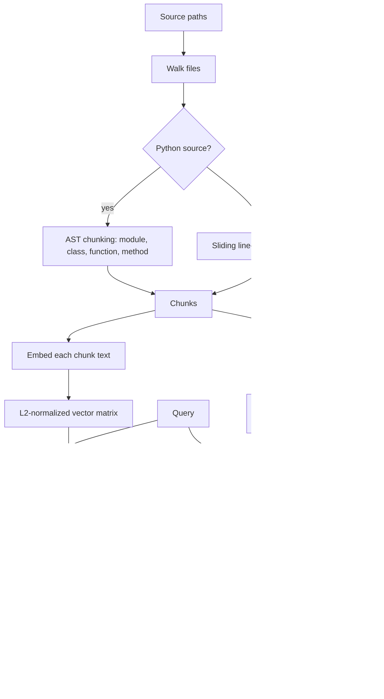
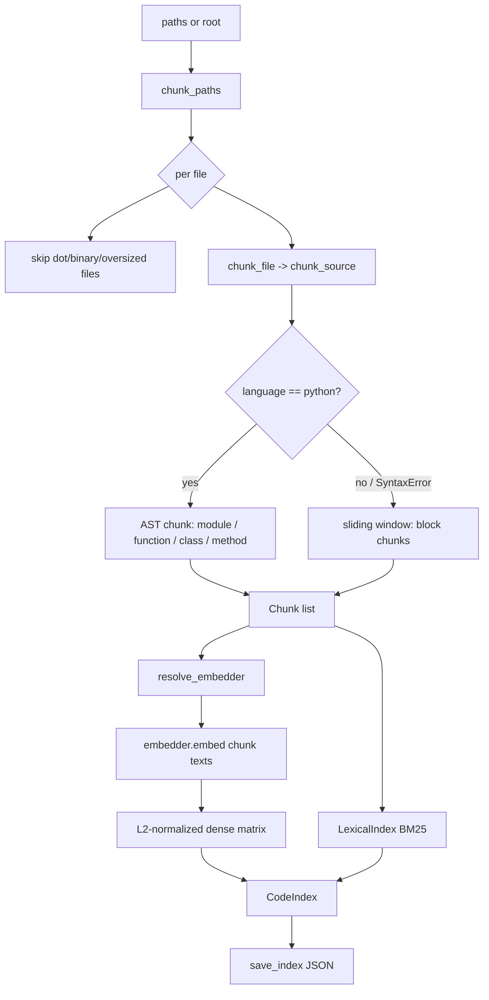
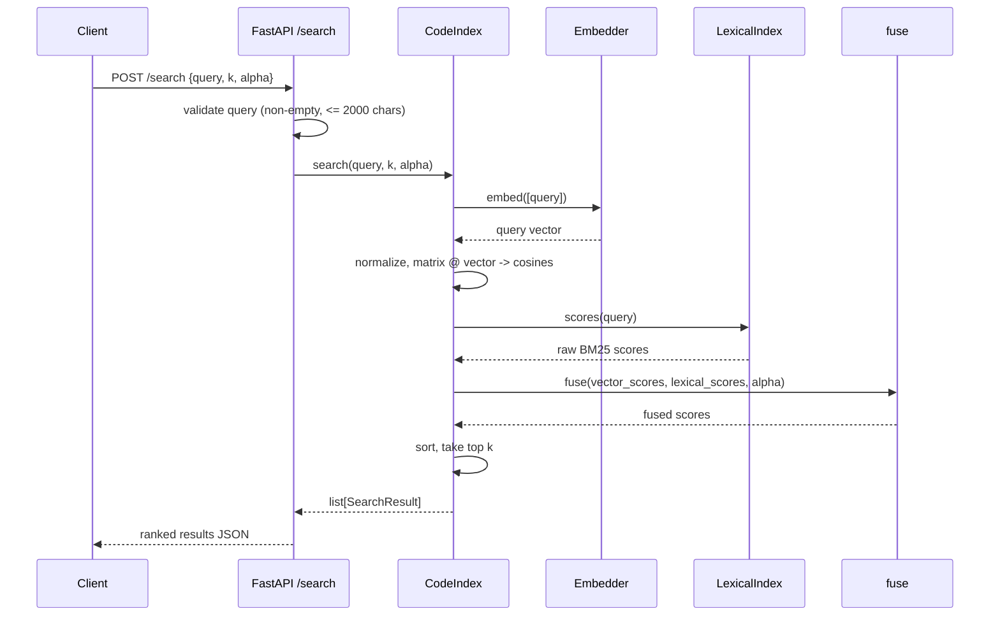

# Architecture

`hybrid-code-search` indexes a source tree into AST-aware chunks, embeds each
chunk into a dense vector, and ranks queries by fusing dense cosine similarity
with BM25 lexical scoring. The default embedder is deterministic and runs
offline; a transformer backend is an optional, opt-in replacement that conforms
to the same protocol.

This document describes the modules under `src/hybrid_code_search/`, the
indexing pipeline, the `/search` request path, the provider-inversion design,
and the rationale for hybrid ranking.

## Pipeline overview

Diagram source: [architecture.mmd](architecture.mmd). A detailed version is in
[diagrams/pipeline.mmd](diagrams/pipeline.mmd).

1. **Chunk.** Files are walked, skipping dot-directories and a fixed set of build
   directories (`node_modules`, `.git`, `.venv`, `dist`, `build`, `__pycache__`),
   binary files (those containing a NUL byte in the first 8 KiB), and files larger
   than `max_file_bytes` (default 1,000,000). Python files are parsed with the
   standard-library `ast` module and split into module, class, function, and method
   chunks; on a `SyntaxError` they fall back to line windows. All other files are split
   into overlapping 40-line windows with 10 lines of overlap (kind `block`). Language is
   inferred from the file extension.

2. **Embed.** Each chunk's text is mapped to a fixed-dimension, L2-normalized vector by
   the configured embedder. The default `HashingEmbedder` hashes tokens into buckets
   with a signed count using blake2b (stable across processes, unlike the builtin
   `hash()`).

3. **Index.** Vectors are stacked into a float32 matrix with each row re-normalized. In
   parallel, chunk text is tokenized and a `LexicalIndex` precomputes BM25 document
   frequencies, term frequencies, lengths, and IDF.

4. **Rank.** At query time the query vector's cosine similarity against every row gives
   the vector scores; BM25 gives the lexical scores. Both sets are min-max normalized to
   `[0, 1]` and combined as `alpha * vector + (1 - alpha) * lexical`. Results are sorted
   by the fused score (ties broken by chunk id) and the top `k` are returned.

Tokenization splits on non-alphanumeric characters and further decomposes camelCase,
snake_case, and letter/digit boundaries, lowercasing each token. Single-character
tokens are dropped unless purely numeric. BM25 uses `k1 = 1.5`, `b = 0.75`.

## Module map

| Module | Responsibility |
| --- | --- |
| `types.py` | Shared dataclasses (`Chunk`, `SearchResult`) and the `Embedder` protocol. |
| `tokenize.py` | Lexical tokenization for code text (identifier/camelCase/digit splitting). |
| `chunker.py` | File discovery and source-to-`Chunk` splitting (AST for Python, sliding window otherwise). |
| `embedder.py` | Embedder implementations and `resolve_embedder()` provider selection. |
| `ranking.py` | BM25 `LexicalIndex`, score normalization, and `fuse()` of dense + lexical scores. |
| `index.py` | `CodeIndex`: holds chunks, the dense matrix, and the lexical index; runs search. |
| `store.py` | JSON persistence of a built index (save/load without re-embedding). |
| `service.py` | FastAPI app exposing `/health`, `/index`, `/search`. |
| `cli.py` | Typer CLI with `index` and `search` commands. |
| `__init__.py` | Public API surface and `build_index()` convenience function. |

### `types.py`

Defines the data contract used everywhere else.

- `Chunk` (frozen dataclass): `id`, `path`, `language`, `kind` (one of
  `function`, `class`, `method`, `module`, `block`), `symbol` (qualified name or
  empty), `start_line`/`end_line` (1-based inclusive), and `text`.
- `SearchResult` (frozen dataclass): the matched `chunk`, the fused `score` in
  `[0, 1]`, the raw `vector_score` (cosine in `[-1, 1]`), and the normalized
  `lexical_score` in `[0, 1]`.
- `Embedder` (runtime-checkable `Protocol`): requires a `name` property, a `dim`
  property, and `embed(texts: list[str]) -> list[list[float]]`. The protocol
  docstring requires implementations to be deterministic so a persisted index
  can be reloaded without drift.

### `tokenize.py`

`tokenize(text)` returns lowercase tokens. It first isolates alphanumeric spans,
then decomposes each span on camelCase boundaries, acronym-to-word transitions,
and letter/digit transitions (so `HTTPResponse` becomes `http`, `response`).
Single-character tokens are dropped unless purely numeric. This same tokenizer
feeds both the hashing embedder and the BM25 index, so the dense and lexical
sides see a consistent vocabulary.

### `chunker.py`

Turns paths into `Chunk` lists.

- `detect_language(path)` maps file extensions to a language name, defaulting to
  `text`.
- `chunk_source(text, path, language=None)` produces chunks. For Python it parses
  the AST (`_chunk_python`) and emits: an optional `module` chunk covering
  top-level statements that are not themselves functions/classes (only when that
  span is at least `_MIN_MODULE_LINES` long, to avoid a redundant near-duplicate
  of a single-symbol file); a `function` chunk per top-level def; a `class` chunk
  per class; and a `method` chunk per def inside a class (symbol `Class.method`).
  Chunks are sorted by line span. If Python parsing raises `SyntaxError`, it
  falls back to the sliding window. All non-Python languages use
  `_sliding_window`, a line window of `_WINDOW_LINES` (40) with `_WINDOW_OVERLAP`
  (10) producing `block` chunks.
- `chunk_file(path)` reads UTF-8 (replacing errors) and returns `[]` on `OSError`.
- `chunk_paths(paths, max_file_bytes=1_000_000)` walks each path. `_iter_files`
  skips dotfiles/dot-directories and the names in `_SKIP_DIRS` (`node_modules`,
  `.git`, `.venv`, `dist`, `build`, `__pycache__`), skips files over the size
  cap, and skips binary files (detected by a NUL byte in the first 8 KiB).
- `_chunk_id` is the first 16 hex chars of `sha1(path:start:end)`, so chunk ids
  are stable for a given location.

### `embedder.py`

Two implementations of the `Embedder` protocol plus a resolver.

- `HashingEmbedder(dim=256)`: feature-hashing. Each token is hashed with
  `blake2b` (8-byte digest); the value selects a bucket (`value % dim`) and a
  separate bit selects a sign so that collisions can cancel rather than always
  reinforce. The accumulated vector is L2-normalized. `blake2b` is used instead
  of the builtin `hash()` because `hash()` is salted per process and would break
  determinism across runs. `name` is `"hashing"`.
- `SentenceTransformerEmbedder(model)`: wraps a `sentence-transformers` model.
  The heavy import is lazy and inside `__init__`, raising a clear `ImportError`
  with install instructions if the optional `transformers` extra is absent.
  `encode` is called with `normalize_embeddings=True`. `name` is
  `"sentence-transformers:<model>"`.
- `resolve_embedder(name=None, model=None)`: selects the backend from the
  arguments or the `SCS_EMBEDDER` / `SCS_MODEL` environment variables, defaulting
  to `"hashing"`. Selecting `"sentence-transformers"` without a model name raises
  `ValueError`. This function is the single seam where the provider is chosen.

### `ranking.py`

The lexical and fusion half of hybrid retrieval.

- `LexicalIndex(chunks)`: builds a BM25 index. At construction it tokenizes every
  chunk, computes term frequencies, document lengths, document frequencies, the
  average document length, and per-term IDF. Scoring is then a pure lookup, which
  keeps it deterministic. Constants are `_BM25_K1 = 1.5` and `_BM25_B = 0.75`.
- `LexicalIndex.scores(query)`: returns `chunk.id -> raw BM25 score`; every chunk
  is present, scoring `0.0` when no query term matches.
- `min_max_normalize(scores)`: scales values into `[0, 1]`, returning all zeros
  when every value is equal (so a tie contributes nothing rather than dividing by
  zero).
- `fuse(vector_scores, lexical_scores, alpha=0.5)`: takes the union of ids,
  min-max-normalizes each side independently, then returns
  `alpha * vector_norm + (1 - alpha) * lexical_norm`. `alpha = 1.0` is pure
  dense; `alpha = 0.0` is pure lexical.

### `index.py`

`CodeIndex` is the in-memory hybrid index.

- Constructor: `CodeIndex(chunks, embedder, matrix, lexical)` stores the chunk
  list, the embedder, the dense matrix, and a `LexicalIndex`.
- `CodeIndex.build(chunks, embedder=None)`: embeds every chunk's text, builds the
  normalized matrix, builds the lexical index, and returns the index. When no
  embedder is passed it defaults to `HashingEmbedder()`.
- `CodeIndex.from_vectors(chunks, embedder, vectors)`: reconstructs an index from
  precomputed vectors without re-embedding; `embedder` may be an instance or a
  name resolved via `resolve_embedder`. Used when rehydrating a persisted index.
- `_as_normalized_matrix` stacks vectors into a `float32` matrix and
  re-normalizes each row (guarding all-zero rows), so the dot product used at
  query time is exactly cosine similarity, and an empty index still yields a
  well-shaped 2-D array.
- `search(query, k=10, alpha=0.5)`: embeds the query, normalizes it, computes
  cosines via `matrix @ query_vector`, gets BM25 scores from the lexical index,
  calls `fuse`, ranks ids by fused score, and returns the top `k`
  `SearchResult`s. Each result reports the fused score, the raw cosine, and the
  min-max-normalized lexical score.

### `store.py`

JSON persistence so an index can be inspected, diffed, and reloaded.

- `save_index(index, path)`: writes `version`, `index.embedder.name`/`.dim`, the
  chunk dataclasses, and `index.vectors`. The write goes to a `mkstemp` sibling
  in the target directory that is `flush`/`fsync`-ed and then `os.replace`-d over
  the target, so a crash mid-write cannot leave a half-written index; the
  temporary file is removed on any error.
- `load_index(path, embedder=None)`: validates the version, embedder metadata,
  chunks, and vectors (including per-vector dimension), checks the chunk/vector
  counts match, then rebuilds the index via `CodeIndex.from_vectors` using the
  stored vectors. Stored vectors are authoritative and are never re-embedded; the
  lexical index is rebuilt from the chunks. When no `embedder` is passed,
  `_resolve` resolves the stored name, falling back to a `HashingEmbedder` of the
  stored dimension if that backend cannot be resolved, so loading does not fail
  just because an optional backend is no longer installed.

### `service.py`

FastAPI application built by `create_app(index=None)`.

- The index lives on `app.state.index` so routes and re-indexing can replace it
  without a module-level global, which keeps the app testable. When no index is
  passed, `app.state.index` is seeded with `CodeIndex.build([], resolve_embedder())`.
- `GET /health` returns status, version, and current chunk count (`len(index)`).
- `POST /index` accepts either `paths` or `root`, chunks them with `chunk_paths`,
  builds a fresh index via `CodeIndex.build(chunks, resolve_embedder())`, and
  swaps it onto `app.state`. Returns the chunk count.
- `POST /search` validates the query (non-empty, at most `_MAX_QUERY_CHARS`
  = 2000 characters), runs `index.search(query, k=k, alpha=alpha)`, and returns
  ranked results. `k` is bounded to `[1, 1000]` and `alpha` to `[0, 1]` by the
  request model.

### `cli.py`

Typer CLI with two commands.

- `index ROOT --out code.index.json --embedder hashing`: chunks the tree, builds
  an index via `CodeIndex.build`, and persists it.
- `search QUERY --index-path code.index.json --k 10 --alpha 0.5`: loads the index
  with `load_index`, calls `code_index.search(query, k=k, alpha=alpha)`, and
  prints `path:start-end symbol score` plus a collapsed snippet per result. A
  missing or invalid index file is reported on stderr and exits with code 1.

### `__init__.py`

Re-exports the public API and defines `build_index(paths, embedder=None)`, which
chunks the paths and returns `CodeIndex.build(chunks, resolved)`. `__version__`
is `"0.1.0"`.

## Indexing pipeline

## `/search` request

## Provider inversion

The embedder is an inverted dependency. Nothing in the chunking, ranking, index,
or service layers depends on a concrete embedding implementation; they depend
only on the `Embedder` protocol in `types.py` (`name`, `dim`, `embed`). Concrete
providers are selected at one seam, `resolve_embedder()`, driven by arguments or
the `SCS_EMBEDDER` / `SCS_MODEL` environment variables.

The default provider is `HashingEmbedder`. It is deterministic, has no model
download, and makes no network calls, so indexing and search work offline out of
the box and produce identical vectors across processes (this is why it uses
`blake2b` rather than the salted builtin `hash()`). The cost is that its vectors
carry no learned semantics beyond token-bucket co-occurrence.

The optional provider is `SentenceTransformerEmbedder`. Its `sentence-transformers`
import is lazy, so the base install never requires the heavy dependency; the
extra is only pulled in when a user selects that backend. Because both providers
satisfy the same protocol and produce L2-normalized vectors, swapping providers
changes only retrieval quality, not the surrounding code. Persistence reinforces
the inversion: `store.py` records vectors verbatim and reloads them without
re-embedding, so an index built with a transformer remains usable even where that
backend is not installed (it falls back to a hashing embedder of the stored
dimension for any future queries).

## Why ranking is hybrid

Code retrieval has two distinct failure modes. Pure dense embeddings capture
paraphrased intent but miss exact identifier and API-name matches that matter in
code. Pure lexical search (BM25) nails exact identifiers but misses queries
phrased differently from the source.

The index runs both and fuses them. `fuse()` min-max-normalizes the dense cosine
scores and the BM25 scores independently into `[0, 1]`, then takes a convex
combination controlled by `alpha`: `alpha * dense + (1 - alpha) * lexical`.
Normalizing each side before combining keeps the two scales comparable so neither
silently dominates. The default `alpha = 0.5` weights them equally; `alpha = 1.0`
is dense-only and `alpha = 0.0` is lexical-only, letting a caller tune toward
semantic recall or exact-match precision per query. The shared tokenizer
(`tokenize.py`) feeds both the hashing embedder and BM25, so the two halves agree
on what a token is.

## Limitations

- AST-aware chunking is implemented for Python only. Every other language is split into
  fixed line windows, which can cut across symbol boundaries. The extension-to-language
  map only labels chunks; it does not change how non-Python files are chunked.
- The default `HashingEmbedder` is not a trained model. It captures token overlap, not
  learned semantics; "vector similarity" with it is closer to a hashed bag-of-tokens
  measure than to meaning. For genuine semantic retrieval, use the
  `sentence-transformers` backend.
- The index is entirely in memory. There is no approximate nearest-neighbor structure:
  search is a dense matrix-vector product over all chunks, which is linear in corpus
  size. This is fine for a single repository and will not scale to very large corpora.
- The index is static once built. There is no incremental update or file-watching;
  changing source requires rebuilding (`build_index` / `scs index` / `POST /index`).
- The HTTP service keeps one index in process memory with no authentication, no
  persistence across restarts, and no concurrency control beyond replacing the index
  reference on re-index.
- Persisted indexes store raw vectors as JSON. The format is inspectable but not
  compact, and is versioned (`version: 1`); loading a different version raises.
- Files are decoded as UTF-8 with replacement; unreadable files are silently skipped
  and contribute no chunks.
