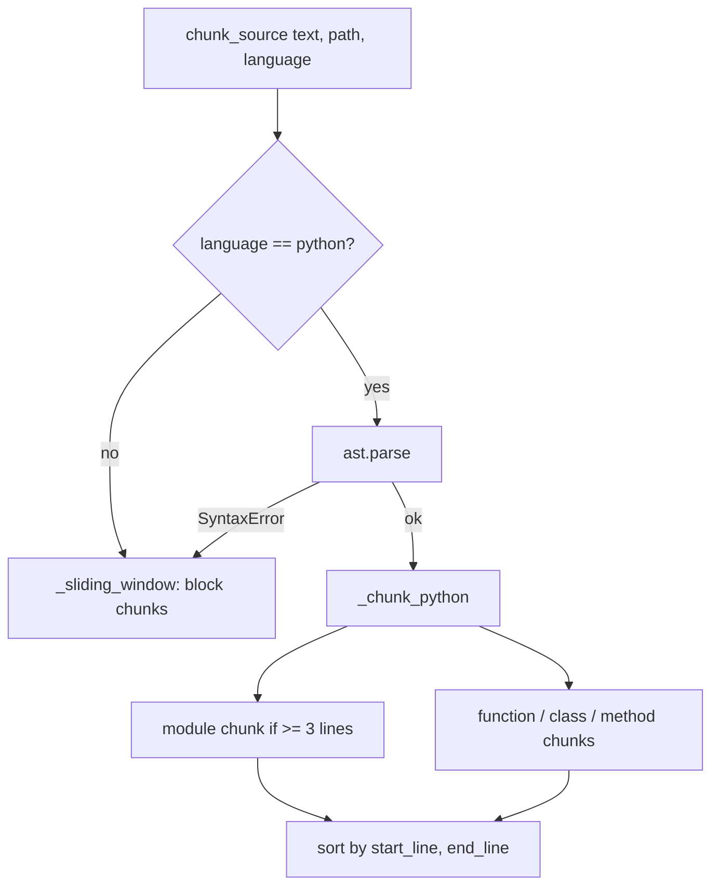

# Chunking

Chunking is the first stage of the [[Index]] pipeline. It converts files on disk
into a flat list of [[Chunk]] spans, each a contiguous, line-bounded region of a
single file. Downstream stages ([[Embedder]], lexical [[Tokenize|tokenization]],
[[Ranking]]) operate on these chunks; chunk boundaries therefore decide the unit
of retrieval.

All chunking logic lives in `src/hybrid_code_search/chunker.py`. The public
entry points are re-exported from the package root: `chunk_source`, `chunk_file`,
`chunk_paths`, and `detect_language`.

## The Chunk record

A chunk is the frozen dataclass `Chunk` (`types.py`):

| Field | Type | Meaning |
| --- | --- | --- |
| `id` | `str` | 16-hex-char SHA-1 of `path:start_line:end_line` |
| `path` | `str` | Source file path the chunk came from |
| `language` | `str` | Detected language name, or `text` |
| `kind` | `str` | One of `function`, `class`, `method`, `module`, `block` |
| `symbol` | `str` | Qualified symbol name, or `""` |
| `start_line` | `int` | 1-based, inclusive |
| `end_line` | `int` | 1-based, inclusive |
| `text` | `str` | The exact source slice for the span |

The `id` is derived from the path and line range only (`_chunk_id`), so two
chunks with the same span in the same file collide by construction. This is
intentional: re-chunking an unchanged file yields stable ids.

## Language detection

`detect_language(path)` maps the lowercased file extension to a language name via
`_EXTENSION_LANGUAGES`. Recognized extensions include `.py` (python), `.js`,
`.ts`, `.tsx`, `.jsx`, `.java`, `.go`, `.rs`, `.rb`, `.c`/`.h` (c), `.cpp`,
`.cs` (csharp), `.php`, and `.md` (markdown). Anything unrecognized returns
`text`.

Detection only selects the chunking strategy and labels the chunk. Only
`python` currently has a dedicated AST path; every other language, including
`text`, falls through to the sliding-window strategy described below.

## AST-aware chunking (Python)

When `chunk_source` sees `language == "python"`, it calls `_chunk_python`, which
parses the file with the standard library `ast` module and walks the top level
of `tree.body`. Three kinds of top-level node become chunks, plus a synthetic
module chunk:

- `FunctionDef` and `AsyncFunctionDef` at module scope -> `kind="function"`,
  `symbol` is the bare function name.
- `ClassDef` at module scope -> `kind="class"`, `symbol` is the class name.
- `FunctionDef`/`AsyncFunctionDef` nested directly inside a class body ->
  `kind="method"`, `symbol` is the qualified name `ClassName.method_name`.

Line ranges come straight from the AST. `start_line` is the node's `lineno`;
`end_line` is the node's `end_lineno` when present, falling back to the start
line otherwise (`_node_end_line`). Because a class chunk spans the whole class
body, a class and its methods produce **overlapping** chunks: the class chunk
covers the methods, and each method is also emitted on its own. This is
deliberate, so a query can match either the class as a whole or one method.

### Qualified symbols

Only methods receive a dotted qualified name (`ClassName.method_name`).
Module-level functions and classes carry their bare name. Nesting is one level
deep: functions defined inside other functions, or classes nested inside
classes, are not separately extracted. They remain inside their enclosing
top-level chunk's `text`.

### The module chunk

Before extracting symbols, `_chunk_python` computes a module span covering the
top-level statements that are *not* themselves functions or classes, that is
docstrings, imports, and bare top-level code. `module_end` is the largest
`end_lineno` among those statements; the module chunk runs from line 1 to
`module_end` with `kind="module"` and empty `symbol`.

The module chunk is emitted only when `module_end >= _MIN_MODULE_LINES` (3). A
file consisting of a single function or class therefore does not produce a
near-duplicate module chunk on top of the symbol chunk.

After all chunks are collected, they are sorted by `(start_line, end_line)`, so
the returned list is in source order.

## Sliding-window fallback

Non-Python files, and Python files that fail to parse, use `_sliding_window`.
Every chunk it produces has `kind="block"` and empty `symbol` (there is no
structural information to attach a name to).

The window is line-based:

- `_WINDOW_LINES = 40` lines per chunk.
- `_WINDOW_OVERLAP = 10` lines shared with the previous chunk.
- The advance per step is `max(1, 40 - 10) = 30` lines.

Lines are split with `splitlines(keepends=True)`, so newline characters are
preserved in `text`. The final window is clamped to the end of the file, and the
loop stops once a window reaches the last line, so the tail is never dropped and
no empty trailing chunk is produced. An empty file yields no chunks.

## Fallback on parse errors

`chunk_source` wraps the Python AST path in a `try`/`except SyntaxError`. If a
`.py` file does not parse, it silently degrades to the sliding-window strategy
rather than failing the whole index build. The chunks it then produces are
`block` chunks labeled `python`, since the language was already detected.

## File and directory traversal

- `chunk_file(path)` reads a single file as UTF-8 with `errors="replace"` and
  chunks it. Unreadable files (`OSError`) yield `[]` rather than raising.
- `chunk_paths(paths, *, max_file_bytes=1_000_000)` walks each input path and
  aggregates chunks from every eligible file. For a directory it uses
  `os.walk`, pruning dotfile directories and the names in `_SKIP_DIRS`
  (`node_modules`, `.git`, `.venv`, `dist`, `build`, `__pycache__`). Files
  larger than `max_file_bytes` (default 1 MB) are skipped, as are binary files,
  detected by the presence of a NUL byte in the first 8192 bytes (`_is_binary`).

`chunk_paths` is the function the rest of the system calls: the [[CLI]] uses it
in its index command, and the [[Service]] uses it when building or refreshing an
index. See [[Index]] for how the resulting chunks are embedded and stored, and
[[Ranking]] for how they are scored at query time.

## Constants reference

| Constant | Value | Role |
| --- | --- | --- |
| `_WINDOW_LINES` | 40 | Lines per sliding-window block |
| `_WINDOW_OVERLAP` | 10 | Overlap between adjacent blocks |
| `_MIN_MODULE_LINES` | 3 | Minimum span to emit a module chunk |
| `max_file_bytes` | 1_000_000 | Per-file size cap in `chunk_paths` |

## See also

- [[Chunk]] - the record type produced here
- [[Index]] - consumes chunks to build the searchable index
- [[Embedder]] - turns chunk text into vectors
- [[Tokenize]] - lexical tokenization used alongside embeddings
- [[Ranking]] - hybrid scoring over chunks
