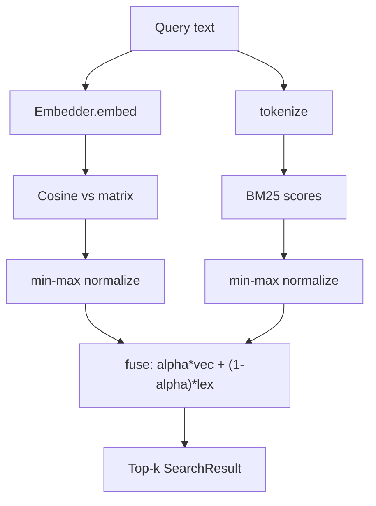
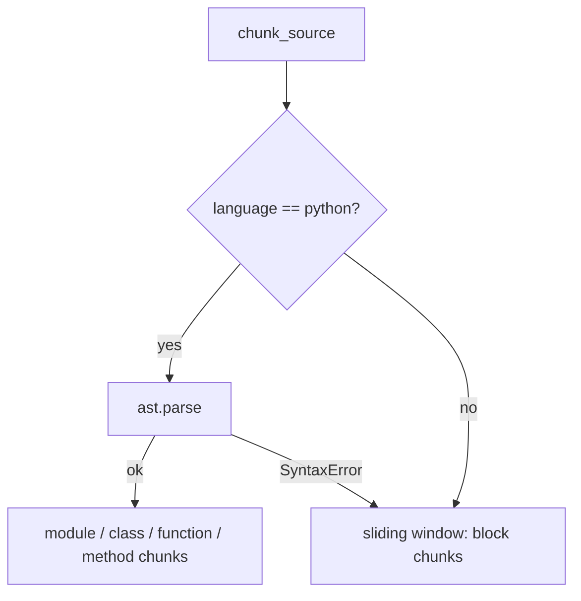

# Design Decisions

This note records the architectural decisions in `hybrid-code-search` and the
reasoning behind them. Each decision is tied to the module that implements it.
Related notes: [[Architecture Overview]], [[Embedders]], [[Ranking and Fusion]],
[[Chunking]], [[Index Persistence]].

## Scope

The package indexes a source tree into chunks, embeds each chunk into a dense
vector, and answers queries by combining vector similarity with BM25 lexical
scoring. The default path runs fully offline; a transformer backend is an
optional extra. See `pyproject.toml`: `numpy`, `fastapi`, `pydantic`, and
`typer` are core dependencies; `sentence-transformers` lives under the
`transformers` extra.

## 1. Provider inversion: the `Embedder` protocol

The package depends on an abstraction, not a concrete model. `Embedder` is a
`runtime_checkable` `Protocol` in `src/hybrid_code_search/types.py`:

- `name: str` — identifies the backend, persisted with the index.
- `dim: int` — vector dimensionality.
- `embed(texts: list[str]) -> list[list[float]]` — one L2-normalized vector
  per input.

The protocol's docstring states the binding constraint: implementations must be
**deterministic** so a persisted index can be reloaded without drift. Two
implementations satisfy it in `embedder.py`:

- `HashingEmbedder` — the offline default.
- `SentenceTransformerEmbedder` — wraps a `sentence-transformers` model. The
  heavy import is performed lazily inside `__init__`, so importing
  `embedder` does not require the optional extra; a missing dependency raises a
  targeted `ImportError` with install instructions.

Selection is inverted to configuration via `resolve_embedder(name, model)`,
which falls back to the `SCS_EMBEDDER` and `SCS_MODEL` environment variables and
defaults to `"hashing"`. Requesting `"sentence-transformers"` without a model
name raises `ValueError`.

Consequences:

- Callers and the index hold an `Embedder`, never a model class. New backends
  are added by implementing three members.
- The default has no model download and no network dependency, so the test
  suite and CLI run deterministically and offline.

See [[Embedders]].

## 2. Deterministic hashing embedder

`HashingEmbedder` (`embedder.py`) is feature hashing over lexical tokens:

1. `tokenize(text)` (`tokenize.py`) produces lowercase tokens, splitting on
   non-alphanumerics and further decomposing camelCase, snake_case, and
   letter/digit boundaries. Single-character non-numeric tokens are dropped.
2. Each token is hashed with `blake2b(digest_size=8)`. The bucket is
   `value % dim`; an independent bit `(value >> 1) & 1` chooses the sign.
3. The accumulated vector is L2-normalized; an all-zero vector is returned
   unchanged.

Two decisions are deliberate:

- **`blake2b`, not the builtin `hash()`.** Python's `hash()` is salted per
  process (`PYTHONHASHSEED`), which would make vectors differ across runs and
  break persisted indexes. A cryptographic digest is stable across processes.
- **Signed buckets.** A per-token sign lets collisions cancel rather than always
  reinforce, reducing hashing bias.

The default dimensionality is 256. This embedder captures lexical overlap, not
deep semantics; semantic recall is the job of the optional transformer backend.
The hybrid design (below) is what makes the cheap default useful.

See [[Embedders]].

## 3. Hybrid BM25 + vector fusion

Lexical and dense scores are computed independently and fused. Implemented in
`ranking.py` and consumed by `index.py`.

### Lexical: BM25

`LexicalIndex` computes BM25 with `k1 = 1.5`, `b = 0.75`. Document frequencies,
per-document term frequencies, lengths, average length, and per-term IDF are
computed once at construction, so `scores(query)` is a pure, deterministic
lookup returning `chunk.id -> raw score` (unmatched chunks score `0.0`). The
empty-corpus and zero-average-length cases are guarded against division by zero.

IDF per term:

```
idf = log(1 + (N - df + 0.5) / (df + 0.5))
```

### Dense: cosine similarity

In `CodeIndex.search` (`index.py`), the query is embedded and L2-normalized.
Because stored rows are already normalized (`_as_normalized_matrix`
re-normalizes defensively), the matrix-vector product `matrix @ query_vector`
is cosine similarity directly.

### Fusion

`fuse(vector_scores, lexical_scores, alpha=0.5)`:

1. Align both score maps over the **union** of chunk ids (missing entries
   default to `0.0`).
2. `min_max_normalize` each side into `[0, 1]`; if all values are equal the side
   contributes zeros.
3. Combine linearly: `alpha * vector + (1 - alpha) * lexical`.

`alpha` is the lexical/vector balance: `alpha=1.0` is pure vector, `alpha=0.0`
is pure lexical, default `0.5`. The HTTP layer constrains `alpha` to `[0, 1]`
and `k` to `[1, 1000]` via Pydantic `Field` (`service.py`).

`SearchResult` (`types.py`) carries the fused `score`, the raw cosine
`vector_score` (range `[-1, 1]`), and the min-max normalized `lexical_score`
(range `[0, 1]`), so a caller can see each component's contribution.



Rationale (README "Why hybrid"): pure embeddings miss exact identifier and
API-name matches that matter in code, while pure lexical search misses
paraphrased intent. Fusing both is the default.

See [[Ranking and Fusion]].

## 4. AST chunking with sliding-window fallback

`chunker.py` turns files into `Chunk` spans. Each `Chunk` (`types.py`) is a
frozen dataclass with a deterministic id, `path`, `language`, `kind`
(`function | class | method | module | block`), `symbol`, 1-based inclusive
`start_line`/`end_line`, and `text`. The id is the first 16 hex characters of
`sha1("{path}:{start}:{end}")`, so the same span always gets the same id.

### Python: AST structure

For Python (`_chunk_python`), the source is parsed with the standard library
`ast` module and split along structure:

- Top-level `FunctionDef` / `AsyncFunctionDef` become `function` chunks.
- `ClassDef` becomes a `class` chunk; its direct method definitions become
  `method` chunks named `Class.method`.
- A leading `module` chunk spans top-level statements that are not themselves
  extracted (docstring, imports, bare code) — but only when that span reaches
  `_MIN_MODULE_LINES` (3), so single-symbol files do not emit a redundant
  near-duplicate chunk.

Chunks are sorted by `(start_line, end_line)`.

### Fallback: sliding window

`chunk_source` selects the strategy by language. Non-Python files, and Python
files that raise `SyntaxError` on parse, fall back to `_sliding_window`:
fixed windows of `_WINDOW_LINES = 40` lines with `_WINDOW_OVERLAP = 10` (step
30), each emitted as a `block` chunk. The overlap avoids splitting a relevant
region exactly on a boundary.



### File selection

`chunk_paths` walks each input path (`_iter_files`):

- Skips dot-directories and `_SKIP_DIRS` (`node_modules`, `.git`, `.venv`,
  `dist`, `build`, `__pycache__`).
- Skips files larger than `max_file_bytes` (default 1,000,000) and files
  detected as binary (a NUL byte in the first 8 KiB).
- Files are read as UTF-8 with `errors="replace"`; unreadable files yield `[]`
  rather than raising.

Language detection (`detect_language`) is by extension, defaulting to `"text"`.

See [[Chunking]].

## Surrounding decisions

### In-memory index, JSON persistence

`CodeIndex` (`index.py`) holds the chunk list, the dense matrix, and the
`LexicalIndex` together; search is matrix-vector plus a dictionary lookup with
no external service. `_as_normalized_matrix` produces a stable
`(0, dim)`-shaped array for an empty index so downstream code can assume a 2-D
array.

Persistence (`store.py`) is JSON so an index can be inspected and diffed.
Stored **vectors are authoritative**: loading never re-embeds. This keeps load
deterministic and independent of whether the original (possibly heavy) embedder
backend is installed at load time — `_resolve` falls back to a
`HashingEmbedder` of the stored dimension when the named backend is unknown.
Writes go to a `.tmp` sibling that is `fsync`-ed and then `os.replace`-d over
the target, so a crash mid-write cannot leave a half-written index. Load
validates the format version, embedder metadata, chunk fields, vector lengths,
and chunk/vector count parity.

See [[Index Persistence]].

### HTTP service holds a mutable index on `app.state`

`create_app` (`service.py`) stores the index on `app.state.index` rather than a
module global. Re-indexing via `POST /index` builds a fresh `CodeIndex` and
rebinds `app.state.index`, which keeps the app testable and avoids mutating
shared module state. `POST /search` strips the query, rejects empty queries and
queries over `_MAX_QUERY_CHARS` (2000) with HTTP 400, and returns ranked
`SearchResultModel`s. `GET /health` reports status, version, and chunk count.

## Note on API drift in the source tree

The modules are not fully consistent in this revision and the documentation
above describes each module as written:

- `index.py` defines `CodeIndex` with a four-argument `__init__`
  (`chunks, embedder, matrix, lexical`) plus the classmethods
  `CodeIndex.build` and `CodeIndex.from_vectors`, and exposes `chunks`,
  `matrix`, `embedder_name`, `dim`, and `search`.
- `service.py` instead constructs `CodeIndex(resolve_embedder())`, calls
  `.add(...)`, and uses `len(index)` — an interface `index.py` does not
  currently provide.
- `store.py` references `index.embedder`, `index.vectors`, and
  `CodeIndex.from_persisted`; `cli.py` imports `search` from `ranking`. Neither
  symbol exists in the current `index.py`/`ranking.py`.

These are integration mismatches to reconcile, not separate designs. The
intended contract is the protocol- and dataclass-level surface in `types.py`
together with the fusion and chunking behavior described above. See
[[Architecture Overview]] for the reconciliation tracking.
