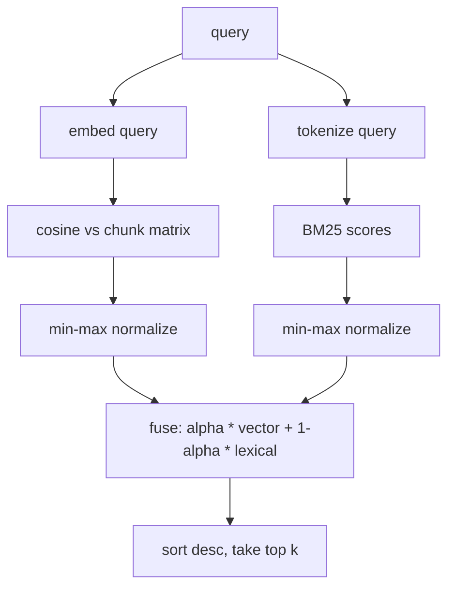

# Glossary

Definitions of the core terms used throughout hybrid-code-search. Each entry is
grounded in the actual implementation under `src/hybrid_code_search`. Where a
term names a concrete symbol, the source file and function are cited so the
definition can be checked against the code.

See also: [[Architecture]], [[Search]], [[Indexing]].

---

## Chunk

A `Chunk` is a contiguous span of one source file, treated as the smallest unit
that gets indexed, embedded, and ranked. It is a frozen dataclass defined in
`types.py` with these fields:

- `id` — a 16-hex-character identifier derived from `sha1("{path}:{start}:{end}")`
  (`chunker._chunk_id`).
- `path` — the file the span came from.
- `language` — detected from the file extension (`chunker.detect_language`),
  defaulting to `"text"` for unknown extensions.
- `kind` — one of `function`, `class`, `method`, `module`, or `block`.
- `symbol` — the qualified name (e.g. `ClassName.method_name`), or `""` for
  module-level spans and anonymous blocks.
- `start_line`, `end_line` — 1-based, inclusive line bounds.
- `text` — the raw source of the span.

Chunks are produced by `chunker.chunk_source`. Python files are split using the
[[#AST]] (`_chunk_python`): a leading `module` chunk for top-level statements
(only when those statements span at least 3 lines), then one chunk per top-level
function and class, plus one `method` chunk per method inside each class. Files
that are not Python, or Python that fails to parse, fall back to a fixed-size
sliding window of 40 lines with 10 lines of overlap (`_sliding_window`),
emitting `block` chunks.

Why this matters: chunking at function/class boundaries keeps each indexed unit
semantically coherent, so an [[#Embedding]] of a chunk represents one idea rather
than an arbitrary slice of a file.

---

## Embedding

An embedding is a fixed-length vector of floats that represents the meaning of a
piece of text, such that texts with similar meaning produce vectors that point in
similar directions. In this project, embeddings are produced by an `Embedder`
(the protocol in `types.py`), which guarantees:

- a `dim` (vector length) and a `name`,
- L2-normalized output vectors (unit length),
- determinism: the same text always yields the same vector, so a built index can
  be persisted and reloaded without drift.

Two implementations ship in `embedder.py`:

- `HashingEmbedder` (default) — feature hashing with no model download and no
  network. Each token from [[#Lexical vs semantic|tokenize]] is hashed with
  `blake2b` into one of `dim` buckets (default 256); a separate hash bit decides
  the sign so that collisions can cancel instead of always reinforcing. The
  accumulated vector is then L2-normalized. `blake2b` is used instead of the
  builtin `hash()` because `hash()` is salted per process and would break
  determinism across runs.
- `SentenceTransformerEmbedder` — wraps a `sentence-transformers` model (a real
  transformer). The dependency is imported lazily and is an optional extra; it is
  only constructed when explicitly selected.

`resolve_embedder` selects the backend from arguments or the `SCS_EMBEDDER` /
`SCS_MODEL` environment variables, defaulting to `HashingEmbedder`.

---

## Cosine similarity

Cosine similarity measures the angle between two vectors, ignoring their
magnitude. For unit-length vectors it equals their dot product, ranging from
`-1` (opposite) through `0` (orthogonal) to `1` (identical direction). It is the
score used for the dense/[[#Lexical vs semantic|semantic]] half of retrieval.

In the index (`index.py`), every chunk vector is stored as a row in a matrix
that is L2-normalized row-by-row (`_as_normalized_matrix`), and the query vector
is normalized the same way. Because both sides are unit length, the matrix-vector
product `self.matrix @ query_vector` yields the cosine similarity of the query
against every chunk in one operation. These cosines become the per-chunk
`vector_score` (recorded in `SearchResult.vector_score`, range `[-1, 1]`).

Re-normalizing inside the index, rather than trusting the embedder, keeps cosine
correct even if a backend returns rows with minor numerical drift, and gives a
stable 2-D shape for an empty index.

---

## BM25

BM25 (Best Matching 25) is a probabilistic ranking function for
[[#Lexical vs semantic|lexical]] retrieval. It scores a document for a query by
summing, over each query term the document contains, three factors:

- **Inverse document frequency (IDF)** — rare terms across the corpus are worth
  more than common ones.
- **Saturating term frequency** — repeating a term raises the score but with
  diminishing returns, controlled by `k1`.
- **Length normalization** — long documents are penalized so they do not win
  simply by containing more words, controlled by `b`.

It is implemented in `ranking.py` as `LexicalIndex`. At construction it
tokenizes every chunk, records per-chunk term frequencies and lengths, the
average document length, and precomputes IDF per term:

```text
idf(t) = log(1 + (N - df(t) + 0.5) / (df(t) + 0.5))
```

`LexicalIndex.scores(query)` then returns `chunk.id -> raw BM25 score` (chunks
with no query-term overlap score `0`). The constants are `k1 = 1.5` and
`b = 0.75` (`_BM25_K1`, `_BM25_B`). Computing the statistics once at construction
keeps scoring a pure, deterministic lookup.

---

## Lexical vs semantic

These are the two complementary notions of "match" that the engine fuses.

- **Lexical** matching is about surface tokens: does the query share actual words
  or identifiers with the chunk? This is what [[#BM25]] scores. Input text is
  reduced to tokens by `tokenize.tokenize`, which splits on non-alphanumeric
  characters and further decomposes `camelCase`, `snake_case`, acronym runs
  (e.g. `HTTPResponse` -> `http`, `response`), and letter/digit boundaries, then
  lowercases the parts. Lexical matching catches exact identifier and API-name
  hits that meaning-based search can miss.
- **Semantic** matching is about meaning: does the chunk express the same intent
  as the query even when the words differ? This is what [[#Cosine similarity]]
  over [[#Embedding|embeddings]] scores. Semantic matching catches paraphrased
  intent that lexical search misses.

Neither alone is sufficient for code: embeddings miss exact symbol matches, and
lexical search misses paraphrase. [[#Hybrid fusion]] combines them.

---

## Hybrid fusion

Hybrid fusion is the step that merges the [[#Lexical vs semantic|semantic]]
([[#Cosine similarity|cosine]]) scores and the [[#Lexical vs semantic|lexical]]
([[#BM25]]) scores into a single ranking score per chunk. It is implemented as
`ranking.fuse`.

The two score sets live on different scales (cosine is `[-1, 1]`; raw BM25 is
unbounded and corpus-dependent), so each is independently rescaled to `[0, 1]`
with `min_max_normalize` before they are combined. `min_max_normalize` returns
all zeros when every input value is equal, which avoids dividing by a zero span.
Fusion is taken over the union of chunk ids appearing in either score set, with
missing entries treated as `0`.

The combined score is a convex combination controlled by [[#Alpha]]:

```text
fused(c) = alpha * vector_norm(c) + (1 - alpha) * lexical_norm(c)
```

In `CodeIndex.search` (`index.py`), the fused scores determine the final order;
results are sorted descending and truncated to the top `k`. Each returned
`SearchResult` carries the fused `score`, the raw `vector_score` (cosine), and
the normalized `lexical_score` so callers can see why a chunk ranked where it did.



---

## Alpha

`alpha` is the scalar weight in `[0, 1]` that sets the balance between the
semantic and lexical halves during [[#Hybrid fusion]]. It is a parameter of
`ranking.fuse` and of `CodeIndex.search`, defaulting to `0.5` (equal weight).

- `alpha = 1.0` — ranking is purely [[#Cosine similarity|semantic]].
- `alpha = 0.0` — ranking is purely [[#BM25|lexical]].
- `0 < alpha < 1` — a blend; higher values favor meaning, lower values favor
  exact token overlap.

The CLI (`cli.py`) and the HTTP `/search` endpoint (`service.py`) both expose
`alpha` as a request parameter; the service constrains it to `[0.0, 1.0]`.

---

## AST

AST stands for Abstract Syntax Tree: the structured, parsed representation of
source code as nested nodes (modules, functions, classes, statements), as
opposed to the raw character stream. The Python standard-library `ast` module
produces it.

hybrid-code-search uses the AST to chunk Python source along real structural
boundaries (`chunker._chunk_python`):

- `ast.parse(text)` builds the tree.
- Top-level `FunctionDef` / `AsyncFunctionDef` nodes become `function`
  [[#Chunk|chunks]]; `ClassDef` nodes become `class` chunks; function defs nested
  inside a class become `method` chunks named `Class.method`.
- Each node's `lineno` and `end_lineno` give exact, 1-based line bounds, so a
  chunk's text is the precise span of that definition.
- Top-level statements that are not themselves extracted (docstrings, imports,
  bare module code) are collected into a single `module` chunk.

If parsing raises `SyntaxError`, chunking falls back to the line-window strategy
used for non-Python files, so a malformed file is still indexable. Only Python
is AST-chunked today; other languages use the sliding window.

---

## Related concepts (quick reference)

- **L2 normalization** — scaling a vector to unit length. Applied to every
  [[#Embedding]] and to each row of the index matrix so the dot product equals
  [[#Cosine similarity]].
- **IDF (inverse document frequency)** — the rarity weight inside [[#BM25]];
  precomputed per term in `LexicalIndex`.
- **Min-max normalization** — rescaling a score set into `[0, 1]` before
  [[#Hybrid fusion]] (`ranking.min_max_normalize`).
- **Sliding window** — the fallback chunking strategy (40-line windows, 10-line
  overlap) for non-Python or unparseable files (`chunker._sliding_window`).
- **Embedder** — the protocol (`types.Embedder`) any embedding backend must
  satisfy: deterministic, L2-normalized, fixed `dim`.
