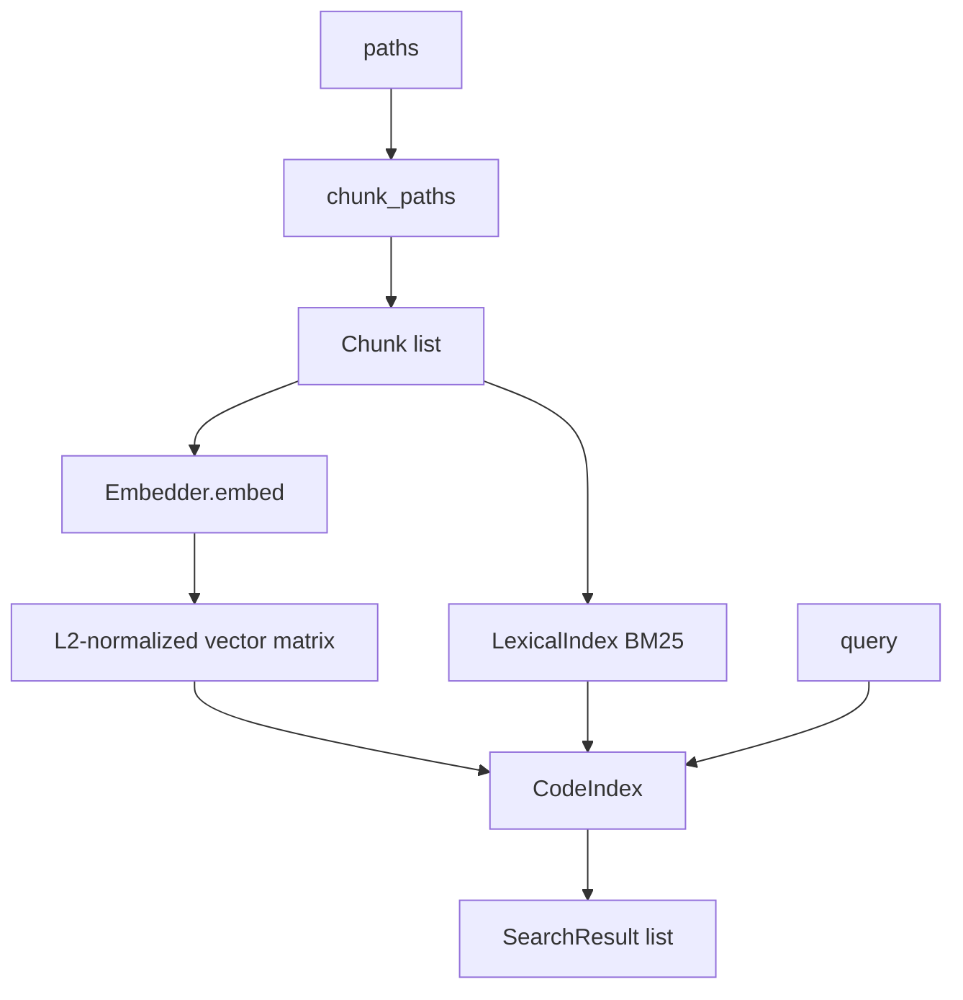

# Home

Map of content for **hybrid-code-search**: a Python library, CLI, and HTTP service
that searches a codebase by combining dense vector similarity with lexical (BM25)
scoring. Source splits into AST-aware [[Chunking|chunks]], each chunk is embedded
by a pluggable embedder, and results are produced by fusing the two score families.
The default embedder is deterministic and runs offline with no model download.

Companion notes: [[Design Decisions]] · [[Ranking]] · [[Chunking]] · [[Glossary]].

## What it does

Given one or more paths, the engine walks the tree, splits each file into chunks,
embeds the chunk text, and builds an in-memory index that answers ranked queries.
A query is scored two ways and the scores are fused; see [[Ranking]] for the math.

The package version is `0.1.0`. Python `>=3.11` is required.

## Package layout

| Module | Responsibility |
| --- | --- |
| `types.py` | `Chunk`, `SearchResult` dataclasses and the `Embedder` protocol |
| `tokenize.py` | `tokenize` — lexical tokenization (camelCase / snake_case / digit splitting) |
| `chunker.py` | File walking and AST-aware [[Chunking]] |
| `embedder.py` | `HashingEmbedder`, `SentenceTransformerEmbedder`, `resolve_embedder` |
| `ranking.py` | `LexicalIndex` (BM25), `min_max_normalize`, `fuse` — see [[Ranking]] |
| `index.py` | `CodeIndex` — holds chunks, the vector matrix, and the lexical index |
| `store.py` | `save_index` / `load_index` — JSON persistence |
| `service.py` | `create_app` — FastAPI service |
| `cli.py` | `scs` command-line entry point |

## Architecture



## Public API

The stable surface is what `hybrid_code_search/__init__.py` re-exports:

- `build_index(paths: list[str], embedder: Embedder | None = None) -> CodeIndex`
  — chunk the paths and build a queryable index. When `embedder` is omitted,
  `resolve_embedder()` is used.
- `CodeIndex` — the in-memory index. Build with `CodeIndex.build(chunks, embedder)`
  or reconstruct from stored vectors with `CodeIndex.from_vectors(chunks, embedder, vectors)`.
  Query with `index.search(query, k=10, alpha=0.5) -> list[SearchResult]`.
- `chunk_file`, `chunk_paths`, `chunk_source`, `detect_language` — see [[Chunking]].
- `LexicalIndex`, `fuse` — see [[Ranking]].
- `HashingEmbedder`, `SentenceTransformerEmbedder`, `resolve_embedder`.
- `save_index`, `load_index` — JSON persistence.
- `tokenize`, and the `Chunk` / `SearchResult` / `Embedder` types.

### Minimal use

```python
from hybrid_code_search import build_index

index = build_index(["src"])
for result in index.search("parse a config file", k=5):
    chunk = result.chunk
    print(chunk.path, chunk.start_line, result.score)
```

`SearchResult` exposes the fused `score` plus the component `vector_score`
(cosine similarity in `[-1, 1]`) and `lexical_score` (normalized to `[0, 1]`).
The `alpha` parameter weights vector vs. lexical; details in [[Ranking]].

## CLI

The `scs` script (declared in `pyproject.toml` `[project.scripts]`) wraps the
Typer app in `cli.py`. Two commands:

- `scs index ROOT [--out code.index.json] [--embedder hashing]` — chunk a tree
  and write a persisted index.
- `scs search QUERY [--index-path code.index.json] [--k 10] [--alpha 0.5]` —
  load a persisted index and print `path:start-end symbol score` lines with a
  one-line snippet.

## HTTP service

`service.create_app(index=None) -> FastAPI` builds an app that holds a mutable
index on `app.state.index`. Endpoints:

- `GET /health` — returns `{status, version, chunks}`.
- `POST /index` — body `{paths?, root?}`; rebuilds the index and returns
  `{chunks}`. One of `paths` or `root` is required.
- `POST /search` — body `{query, k=10, alpha=0.5}`; returns ranked results.
  Empty queries and queries over 2000 characters are rejected with HTTP 400.

`uvicorn` is a declared dependency for running the service.

## Embedders

`resolve_embedder(name=None, model=None)` selects a backend. With no arguments it
reads the `SCS_EMBEDDER` environment variable (default `hashing`) and `SCS_MODEL`.

- `HashingEmbedder` (default, `dim=256`) — deterministic feature hashing over
  tokens using `blake2b`, then L2-normalized. No network, no model download.
- `SentenceTransformerEmbedder` — backed by `sentence-transformers`, imported
  lazily. Requires the optional `transformers` extra
  (`pip install 'hybrid-code-search[transformers]'`). Selected by setting
  `SCS_EMBEDDER=sentence-transformers` and `SCS_MODEL=<model>`.

All embedders satisfy the `Embedder` protocol: `name`, `dim`, and
`embed(texts) -> list[list[float]]` returning one L2-normalized vector per text.
The protocol contract requires determinism so a persisted index reloads without
drift. See [[Design Decisions]] for why this matters.

## Persistence

`save_index(index, path)` writes JSON (version `1`) containing embedder metadata,
chunk records, and the raw vectors. The write goes to a `.tmp` sibling that is
`fsync`-ed and atomically renamed over the target. `load_index(path, embedder=None)`
rebuilds the index, reusing stored vectors verbatim (never re-embedding) and
rebuilding the lexical index from the chunks. If the originally named embedder
backend is unavailable at load time, it falls back to a `HashingEmbedder` of the
stored dimension, since the stored vectors are authoritative for ranking. Vector
dimension is validated against the stored `dim`. Rationale: [[Design Decisions]].

## Development

```
pip install -e ".[dev]"
ruff check .
ruff format --check .
mypy src
pytest --cov=hybrid_code_search
```

Lint selects rule families `E, F, I, UP, B, SIM`; line length is 100.

## See also

- [[Chunking]] — how files become chunks (AST for Python, sliding window otherwise).
- [[Ranking]] — BM25, normalization, and `fuse`.
- [[Design Decisions]] — offline default, JSON persistence, determinism.
- [[Glossary]] — terms used across these notes.
