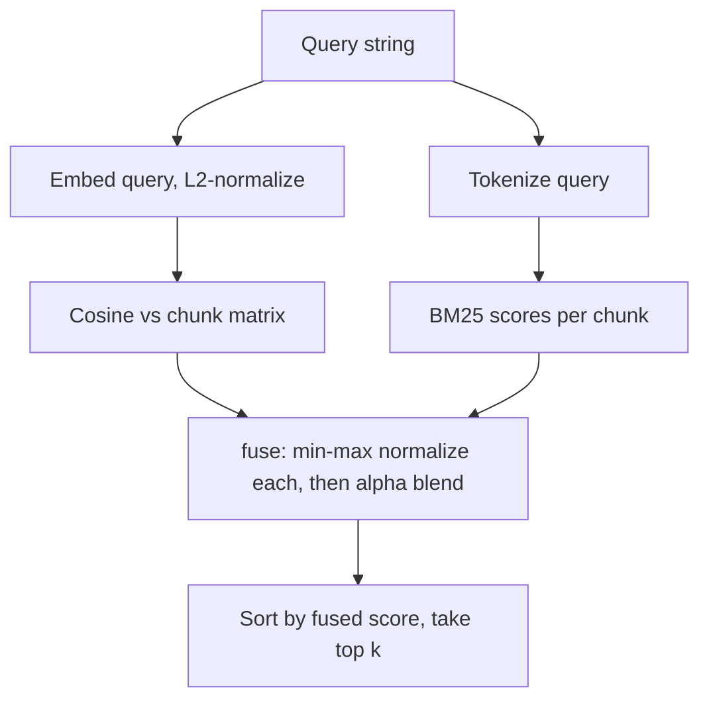

# Ranking

How hybrid-code-search scores a query against indexed code chunks. The final
rank is a fusion of two independent signals: a dense [[Glossary#Cosine similarity|cosine]]
score from embeddings and a lexical [[Glossary#BM25|BM25]] score from tokenized
text. Both are rescaled with [[Glossary#Min-max normalization|min-max normalization]]
and combined by an [[Glossary#Alpha fusion|alpha]] weight.

Implementation: `src/hybrid_code_search/ranking.py` (lexical scoring, normalization,
fusion) and `src/hybrid_code_search/index.py` (cosine scoring and the search
pipeline). See [[Glossary]] for term definitions.

## Pipeline overview



The two branches are computed independently and only meet inside `fuse`. A chunk
that scores well on either signal can surface; a chunk that scores well on both
ranks highest.

## Lexical scoring: BM25

`LexicalIndex` in `ranking.py` builds a [[Glossary#BM25|BM25]] index over the
tokenized text of every [[Glossary#Chunk|chunk]] at construction time. Document
frequencies, per-chunk term frequencies, and per-chunk lengths are computed once,
so `scores()` is a pure lookup and is deterministic.

Tokenization is handled by `tokenize()` in `src/hybrid_code_search/tokenize.py`:
text is split on non-alphanumeric characters, then each span is further broken on
camelCase, snake_case, and letter/digit boundaries, and lowercased. Single-character
tokens are dropped unless purely numeric. This means `parseHTTPResponse` becomes
`parse`, `http`, `response`, so an identifier query matches its component words.

The constants are fixed in the module:

- `_BM25_K1 = 1.5` — term-frequency saturation.
- `_BM25_B = 0.75` — length-normalization strength.

Inverse document frequency is precomputed per term:

```
idf(t) = ln(1 + (N - df(t) + 0.5) / (df(t) + 0.5))
```

where `N` is the chunk count and `df(t)` is the number of chunks containing term
`t`. The `1 +` form keeps IDF non-negative even for very common terms.

Per chunk, with length `len` and corpus average length `avg`, the length norm is:

```
norm = k1 * (1 - b + b * len / avg)
```

and the score sums over the distinct query terms present in the chunk:

```
score = sum over t in query of  idf(t) * (freq * (k1 + 1)) / (freq + norm)
```

`freq` is the term's frequency in that chunk. Terms absent from the chunk contribute
nothing. `scores()` returns a `chunk.id -> score` map covering every chunk; chunks
with no query-term overlap score `0.0`. If the query has no tokens, or the corpus
average length is `0.0` (empty index), every chunk gets `0.0`.

## Dense scoring: cosine similarity

Dense scoring lives in `index.py`. At build time, each chunk's text is embedded
and the rows are stacked into a float32 matrix, with every row
[[Glossary#L2 normalization|L2-normalized]] by `_as_normalized_matrix`. All-zero
rows are left at zero (their cosine stays `0`).

At query time `CodeIndex.search` embeds the query, L2-normalizes it, and takes the
matrix-vector dot product:

```python
cosines = self.matrix @ query_vector
```

Because both the stored rows and the query vector are unit length, this dot product
is exactly [[Glossary#Cosine similarity|cosine similarity]], which lies in
`[-1, 1]`. The result is a `chunk.id -> cosine` map (`vector_scores`).

The default embedder is `HashingEmbedder` (`src/hybrid_code_search/embedder.py`),
a deterministic feature-hashing embedder requiring no model download or network.
Any object satisfying the `Embedder` protocol in `types.py` can be substituted.

## Min-max normalization

`min_max_normalize` in `ranking.py` rescales a score map into `[0, 1]`:

```
normalized(x) = (x - lo) / (hi - lo)
```

where `lo` and `hi` are the minimum and maximum over the map's values. This is
applied to the BM25 and cosine maps separately so the two signals are on a common
scale before they are blended; the two metrics have unrelated raw ranges (BM25 is
unbounded and non-negative, cosine is `[-1, 1]`).

Edge cases:

- An empty map returns an empty map.
- If all values are equal (`hi == lo`), every entry returns `0.0`, since there is
  no spread to preserve.

Normalization is per query and per result set: it depends only on the scores in
the current candidate set, not on any global statistic.

## Alpha fusion

`fuse` in `ranking.py` combines the two signals over the union of their chunk ids.
Missing ids on either side are treated as `0.0`, then each side is min-max
normalized, then blended:

```
fused(id) = alpha * vector_norm(id) + (1 - alpha) * lexical_norm(id)
```

`alpha` defaults to `0.5` (equal weight). It is exposed end to end:
`CodeIndex.search(query, k=10, alpha=0.5)` and the `/search` HTTP endpoint in
`service.py`, where it is validated to `0.0 <= alpha <= 1.0`.

Interpreting [[Glossary#Alpha fusion|alpha]]:

- `alpha = 1.0` — pure dense/[[Glossary#Cosine similarity|cosine]] ranking; lexical
  signal ignored.
- `alpha = 0.0` — pure lexical/[[Glossary#BM25|BM25]] ranking; vector signal ignored.
- `0 < alpha < 1` — a blend; `0.5` weights both equally.

This is the project's core stance: dense embeddings capture paraphrased intent but
miss exact identifier and API-name matches, while lexical search captures exact
matches but misses paraphrase. Fusing both is the default for code search.

## Result assembly

After fusion, `search` sorts chunk ids by fused score in descending order and keeps
the top `min(k, len(chunks))`. Each surviving id becomes a
[[Glossary#SearchResult|SearchResult]] (`types.py`) carrying three numbers:

- `score` — the fused value in `[0, 1]`.
- `vector_score` — the raw cosine in `[-1, 1]` (the un-normalized value).
- `lexical_score` — the BM25 score after min-max normalization, in `[0, 1]`.

Note the asymmetry: `vector_score` is reported raw, while `lexical_score` is reported
normalized. The `score` field uses the normalized form of both, as produced by `fuse`.

Searches short-circuit to an empty list when the index has no chunks or the query
is empty after stripping whitespace.

## Determinism

Every stage is deterministic for a fixed index and query: BM25 statistics are frozen
at construction, the default embedder uses `blake2b` (not the salted builtin `hash()`)
so vectors are stable across processes, and normalization and fusion are pure
functions of their inputs. The same query against the same index always returns the
same ranking.

## Related

- [[Glossary]] — definitions of BM25, cosine similarity, min-max normalization,
  alpha fusion, and chunks.
